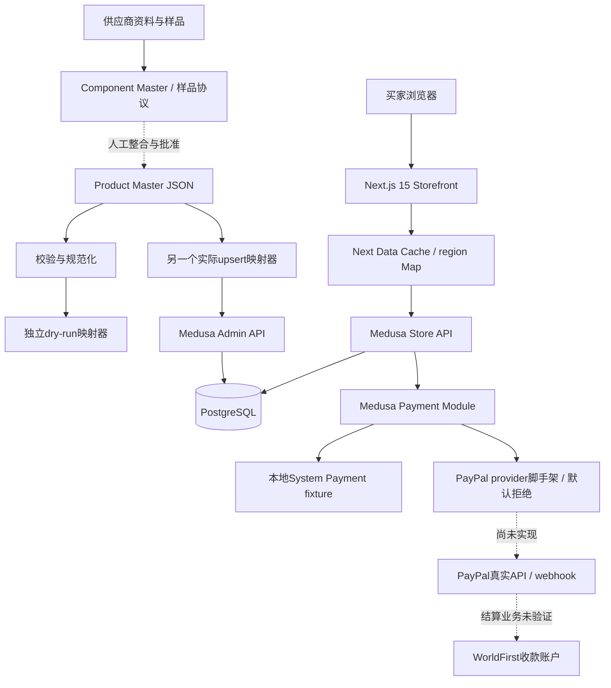

# 架构、目录、文档与推进方式

## 独立形成的架构图

图中虚线表示尚未接线或依赖人工业务流程，并非已存在的自动化。当前没有理由认为Next+Medusa+PostgreSQL基础分层选错，也没有证据支持推倒重做。问题主要集中于边界上的事实准确性：被审批的数据是否真写入、显示的成功是否有后端变化、支付事件是否真被消费、测试是否覆盖真实路径。

## 目录与仓库判断

实际工作区是外层文档 Git 仓库 + 内层源码 Git 仓库；演示 Medusa/Spree还保留各自上游/基准上下文。最初普通 `rg --files` 会被外层 `.gitignore` 排除整个源码目录，因此本次重新使用包含ignore内容的、排除生成物的搜索。只在外层执行git status不能证明源码状态。

| 目录 | 当前职责 | 审查处理 |
|---|---|---|
| 外层 payment/product/operations/ui | 人工工作文档、状态和历史证据 | 作为声明与需求，对照代码重新核实 |
| `03_template/medusa-crossborder-base` | 唯一当前应用 | 深查后端、storefront、声明、脚本和测试 |
| `05_product` | 商品、供应链JSON与本地工具 | 深查状态/导入/库存/证据 |
| `06_payment` | 支付参考和能力边界 | 区别于实际Medusa provider |
| `02_demos`、`01_research`、archive | 选型/演示/历史 | 核对角色和配置隔离，不对第三方demo做逐文件重审 |
| `_review_outbox`、生成目录 | 打包、运行、缓存 | 不将历史产物当作当前源码证据 |

这种组织能保留选型历史，但“mother template”现已承载品牌UI和真实商品业务，应明确它是当前应用，不再暗示每次功能开发都复制一份。短期保留路径以减少破坏，只在入口文档给出一条准确开发入口；有正常CI与可重复部署后，再考虑迁到apps/backend、apps/storefront的常规源码根结构。

## AR-01 · P2 · 证据系统过多，缺少一个可执行的当前状态定义

有 CURRENT_STATE、PROJECT_STATUS、00_HANDOFF、多个CHECKPOINT/ROUND/MANIFEST，以及数十份PAYMENT/PRODUCT/VALIDATION文件。这些文档记录了重要边界，但同一事实重复出现，历史PASS与当前状态难分。

具体例子：CURRENT_STATE称round2 closing，PROJECT_STATUS.last_completed_task却为FIX-R2-FINAL；Product Import Guide还说normalized目录仅保留说明，实际已有规范商品；`product/PRODUCT_DATA_CONTRACT.md` 宣称Schema等价结构检查和映射，实际映射器分叉；旧dependency triage与当前lock版不同。不是要求历史文档全部重写，而是不要把它们同时标为“当前authority”。

建议每个领域只保留：一个当前契约、一个问题/上线gate表、一个可执行验证入口。报告PASS带上commit、命令、测试数量、环境、失败/未测范围；历史证据仅链接和标注日期，不手工级联刷新所有历史文件。将本次每个finding变成可关闭条目，修复后用测试证据关闭，而非再写一份没有机器验证的总PASS。

## AR-02 · P1（发布流程）· 两仓库状态与构建证据没有自然原子性

源码变更与文档状态是两次独立提交。外层明确忽略内层源码；更新文档无法携带源码变更，复制/克隆文档也不会自动获得完整可运行项目。嵌套模板的.github不会成为源码根CI。

短期方案足够简单：每次可发布版本记录源码HEAD+文档HEAD+锁文件hash+构建artifact标识+环境契约版本；在源码Git根运行CI。不要在刚发现这些问题时立即合并仓库、重写历史或移动全部归档。必须先解决“执行什么才能证明这版可工作”。

## AR-03 · P1（阶段顺序）· 支付作为唯一下一阶段，会晚发现履约和商品可行性问题

ROADMAP把物流、税务、履约、政策和单位经济放在支付之后；PRODUCTION_READINESS虽然列全了事项，却基本没有负责人、输入、验收数据、失败出口。供应链记录显示样品未测、采购HOLD、个人消费者直发未知，这些可能改变物流模型、结账金额乃至是否销售该商品。

建议下一阶段分两条可独立推进的工作线：商家PayPal资格/沙箱能力；商品样品+真实履约方式+完整单位成本。在这两条获得最低可行证据后再做单商品端到端交易。不是等待所有业务都完善才写支付，而是先消除会推翻方案的大不确定性。

## AR-04 · P2 · 软件复杂度已经超过首个SKU的必要范围

当前保留国家/币种选择、账户注册/验证/转移、Stripe多方式、WorldFirst参考、PayPal新provider、组件/BOM/套装框架，以及多个选型demo。它们并非都错误，但每多开放一条入口就增加一套失败恢复与测试义务。

最小可上线切片应是一个明确市场、USD商品、一个真实支付方式、一种履约流程、少数必要政策和客服渠道。可以保留代码但隐藏未兑现的入口；不必删除全部starter或强行降级平台。账号邮箱假成功和订单转移GET等已暴露功能必须修，未暴露的复杂功能可延后。

## AR-05 · P1（上线验收）· 必须验证“钱、货、订单、通知”一致性

现在本地smoke善于验证API→Admin→SQL相符，但使用System Payment/测试物流，只能证明技术工作流。真实闭环至少包括：金额由后端定价；支付重试幂等；授权/捕获/退款事实能在订单中正确显示；不收到款不误发货；支付成功下单失败可恢复；最后一件库存并发；物流失败可退款/补发；邮件能送达；备份真的能恢复。

这不是引入复杂分布式系统的要求。首批少量订单可以人工捕获、人工发货、人工异常对账，但必须明确负责者、时限、记录和补救。自动化程度低可以上线，资金/库存事实不可信不可以。

## 不应现在修改的地方

1. 不重新做Medusa/Spree平台选型、不换数据库、不重建整个storefront。当前缺陷可在现有分层内修复。
2. 不解除真实支付和technical fixture默认关闭，不伪造库存、税率、时效、HS/FTO/样品通过事实。
3. 不大改已形成的视觉风格、字体、用户批准产品图，不为了“优化”重绘真实产品或生成假评价。
4. 不把WorldFirst收款账户强行写成checkout gateway；不把06_payment参考抽象接成第二套运行支付系统。
5. 不立即部署多地区、微服务、搜索引擎、PIM、ERP、复杂营销或自动采购；先解决一个订单的真实闭环。
6. 不批量清理历史档案、demo和无关dead code；先标清角色、建立CI与受控发布，再逐步归档。
7. 不做未经兼容验证的依赖全局major override；锁定版本仍有价值，安全更新应按调用路径和测试推进。

审查采取“保留核心架构，收紧可见功能和事实边界”的结论，不以代码/文档数量评估成熟度。
